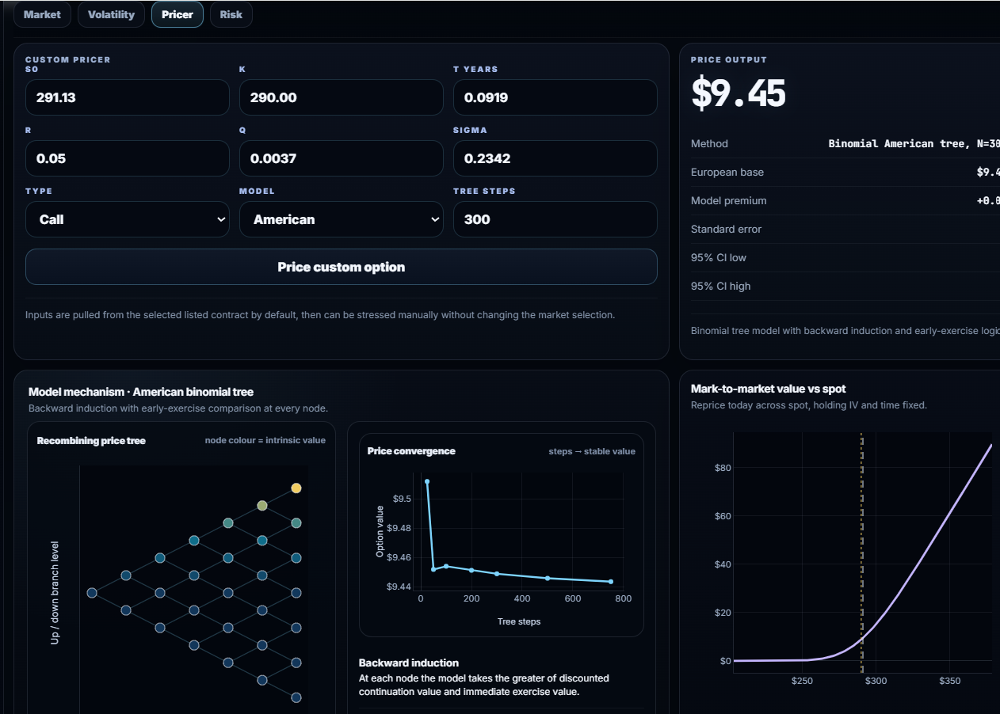
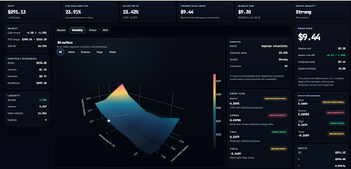
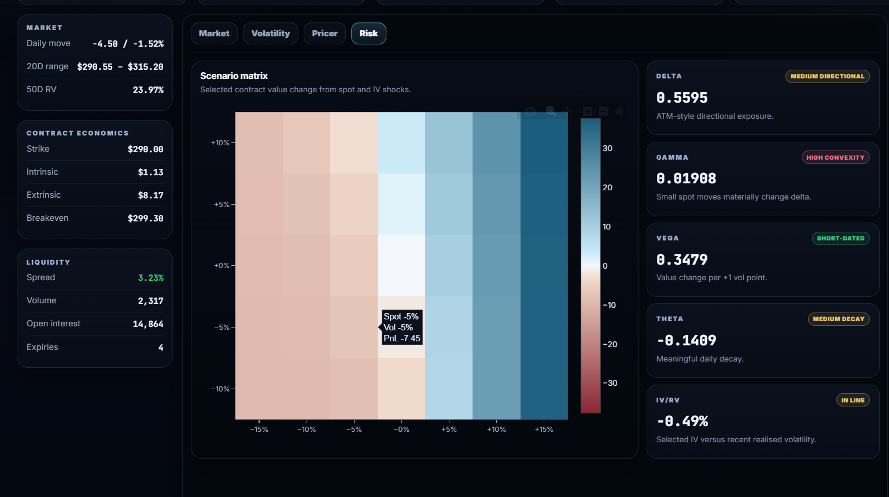
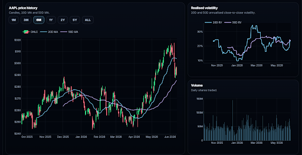
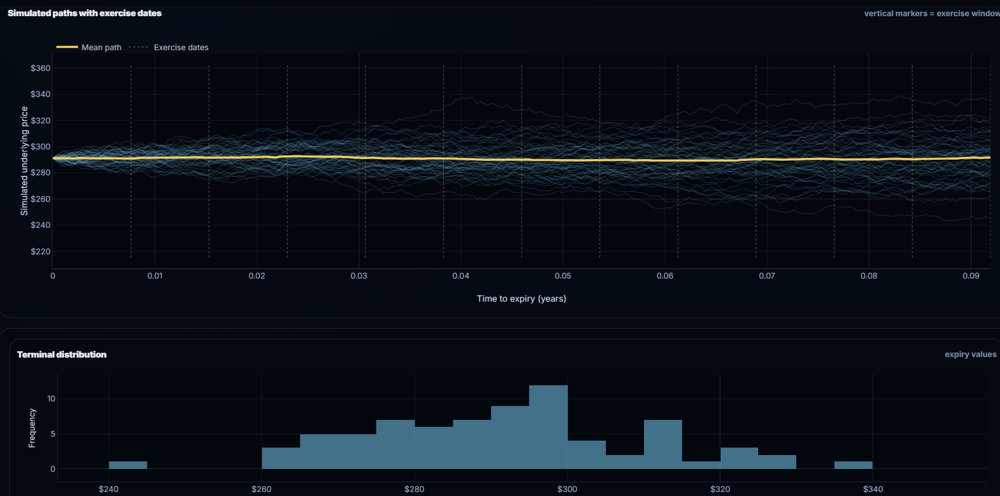

# Options Pricing & Volatility Analytics Platform

A modular derivatives analytics platform built in Python with a FastAPI backend and React frontend.

The project combines quantitative pricing models, implied volatility analytics, Monte Carlo simulation, and live option-chain data into an interactive analytics dashboard.



---

# Features

* Black–Scholes pricing and analytical Greeks
* Implied volatility extraction using numerical root-finding
* American option pricing with binomial trees
* Asian option pricing using Monte Carlo simulation
* Bermudan option pricing using Longstaff–Schwartz regression
* Volatility smile and surface construction from live market data
* Greeks and risk visualisation
* Monte Carlo path simulation and convergence analysis
* Interactive frontend dashboard with FastAPI API integration

---

# Pricing Models

## European Options

Closed-form Black–Scholes pricing with:

* Delta
* Gamma
* Vega
* Theta
* Rho

## American Options

Binomial lattice pricing with convergence analysis.

## Asian Options

Arithmetic-average Asian option pricing using Monte Carlo simulation.

## Bermudan Options

Least-squares Monte Carlo (Longstaff–Schwartz) implementation for early exercise modelling.

---

# Volatility & Risk Analytics

The platform retrieves live option-chain data using Yahoo Finance and constructs:

* Implied volatility smiles
* ATM term structures
* Volatility surfaces
* Greeks exposure metrics
* Risk and scenario visualisations





---

# System Architecture

## Backend

* Python
* FastAPI
* NumPy
* Pandas
* SciPy

The backend handles:

* pricing logic
* volatility calculations
* Monte Carlo simulation
* market data ingestion
* API endpoints

## Frontend

* React
* Vite

The frontend provides an interactive terminal-style dashboard for visualising option chains, pricing outputs, volatility surfaces, and risk metrics.

---

# Example Analytics

## Market Analytics



## Bermudan Monte Carlo Pricing



---

# Project Structure

```text
Engine/
Pricing/
frontend/
api.py
```

---

# Running the Project

## Backend

```bash
uvicorn api:app --reload --host 127.0.0.1 --port 8000
```

## Frontend

```bash
cd frontend
npm run dev
```

---

# Future Extensions

Planned areas for further development:

* Local volatility models
* Stochastic volatility models
* Volatility surface fitting
* Portfolio risk aggregation
* Stress testing and scenario analysis
* Historical volatility surface dynamics

---

# Disclaimer

This project was built for educational and research purposes and should not be used for live trading or financial advice.
