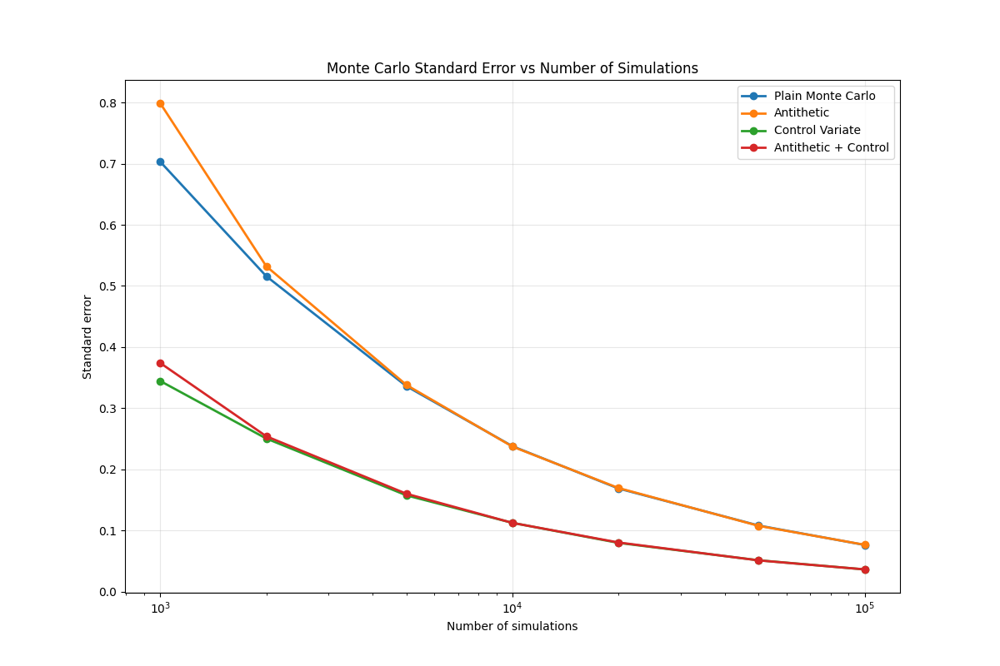
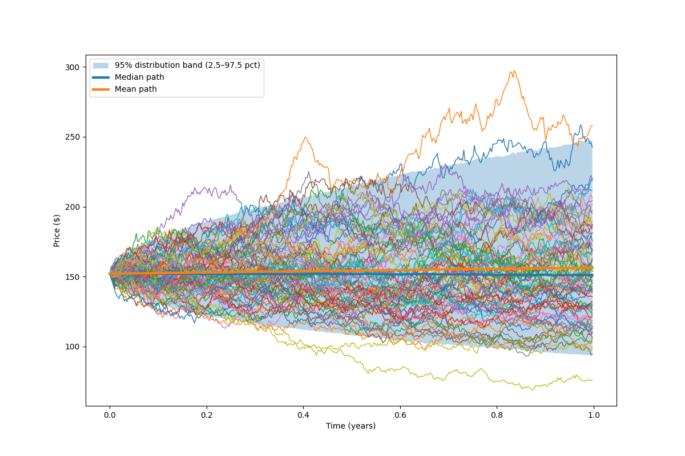
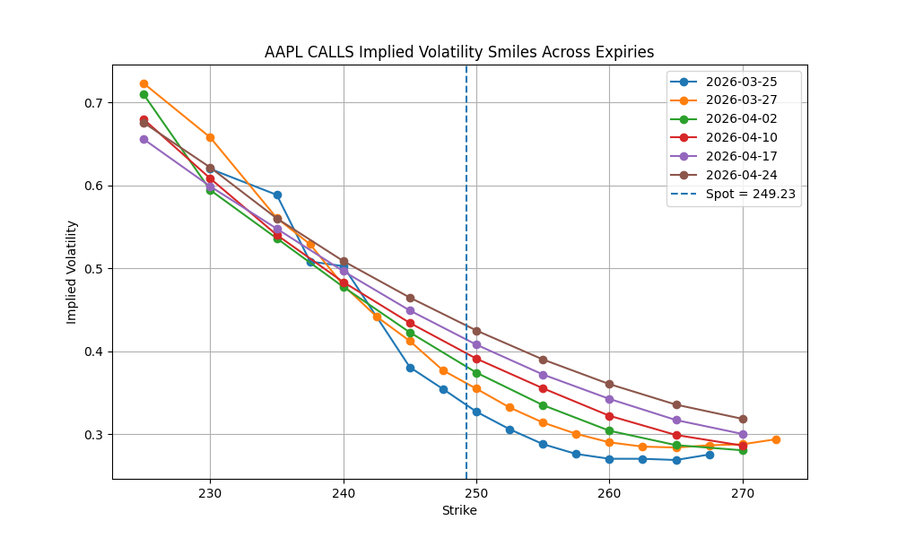
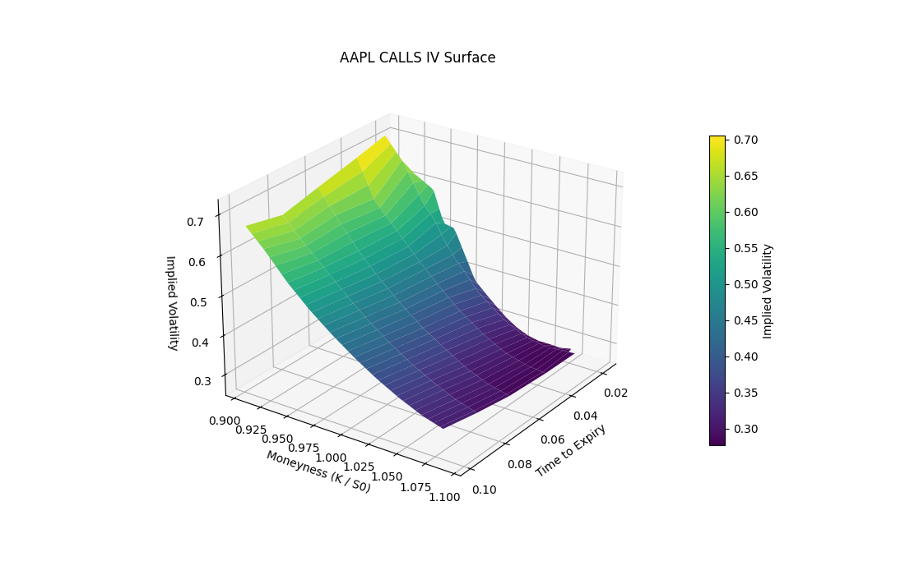

# Options Pricing Engine and Volatility Surface in Python

This project implements a small options analytics engine in Python, including Black–Scholes pricing, implied volatility extraction, Monte Carlo simulation with variance reduction, and construction of implied volatility smiles and surfaces using live market data.

The aim of the project was to explore numerical methods for derivatives pricing and to build a modular codebase for experimenting with option models, volatility structures, and Monte Carlo techniques.

## Features

- Black–Scholes option pricing
- Implied volatility solver
- Greeks calculation
- Monte Carlo pricing of European options
- Antithetic variates and control variates for variance reduction
- Convergence analysis of Monte Carlo estimators
- Retrieval of option chain data using Yahoo Finance
- Construction of implied volatility smiles across expiries
- ATM volatility term structure
- Implied volatility heatmaps, contours, and 3D surfaces

## Project Structure

Engine/
    Black_Scholes.py
    implied_vol.py
    GBM_plot.py
    GBM_terminal.py
    market_data.py
    volatility_surface.py

demo_options.py

Figures/
    se_vs_paths.png
    iv_smile.png
    iv_surface.png
    gbm_paths.png

Black_Scholes.py – pricing and Greeks  
implied_vol.py – implied volatility solver  
GBM_plot.py – geometric Brownian motion path simulation  
GBM_terminal.py – Monte Carlo pricing and variance reduction  
market_data.py – option chain download and cleaning  
volatility_surface.py – smiles, term structure, and surface plots  
demo_options.py – example script running the full workflow  

## Monte Carlo Simulation

Monte Carlo pricing is implemented for European call options under geometric Brownian motion.

Variance reduction methods included:

- Antithetic variates
- Control variate using terminal stock price
- Combined antithetic + control

The convergence behaviour of the estimator is analysed by plotting the standard error against the number of simulated paths.

### Standard Error vs Number of Paths

This shows the expected O(N^-1/2) convergence and the improvement from variance reduction.

## Geometric Brownian Motion Simulation

Simulated stock price paths under risk-neutral dynamics.

## Implied Volatility Smiles

Option chains are downloaded using Yahoo Finance and used to compute implied volatilities across strikes and expiries.

## Implied Volatility Surface

The project constructs volatility surfaces in moneyness–time space.

## Requirements

Python 3.10+

Required libraries:

numpy  
pandas  
matplotlib  
yfinance  
scipy  

Install with:

pip install numpy pandas matplotlib yfinance scipy

## Running the demo

Run the full workflow with:

python demo_options.py

This will:

- simulate GBM paths
- run Monte Carlo pricing
- compare variance reduction methods
- download option data
- plot smiles and volatility surfaces

## Future work

Possible extensions:

- SVI / spline fitting of the volatility surface
- Local volatility / stochastic volatility models
- Volatility risk premium analysis
- Surface dynamics over time
- Calibration to market data

## Author

Built as part of self-study in quantitative finance, numerical methods, and derivatives pricing.
